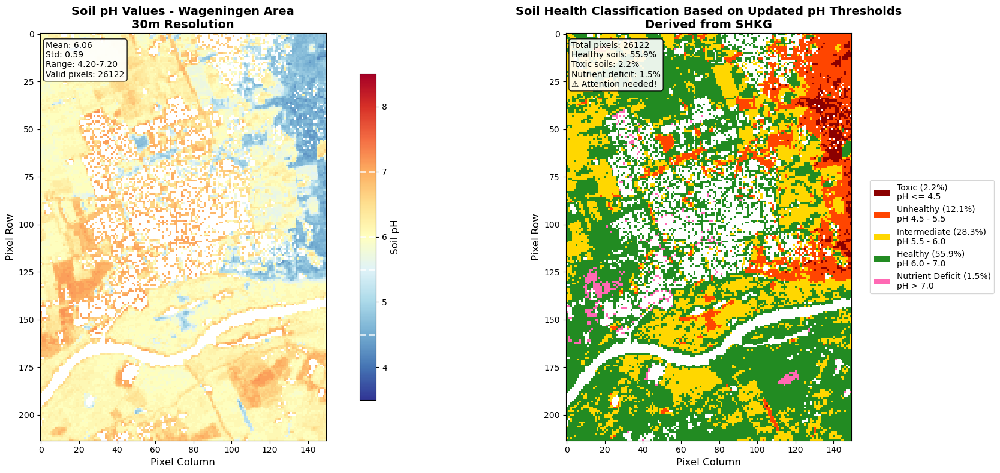
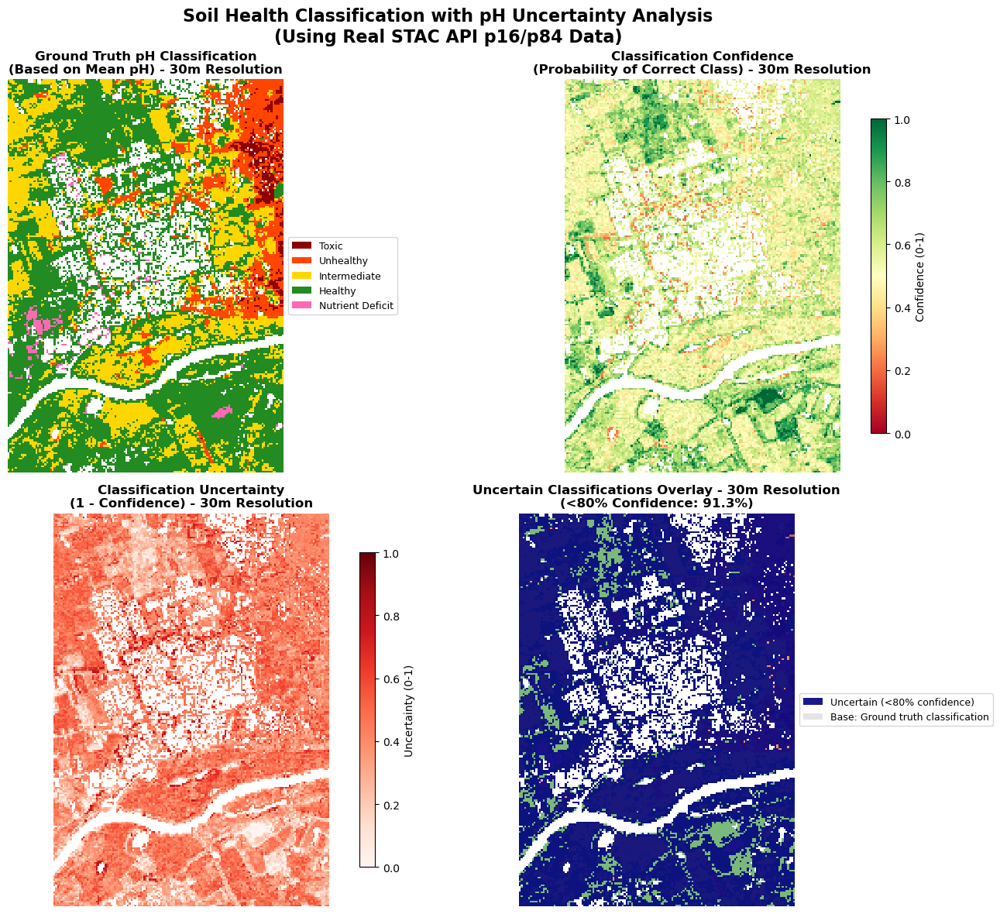
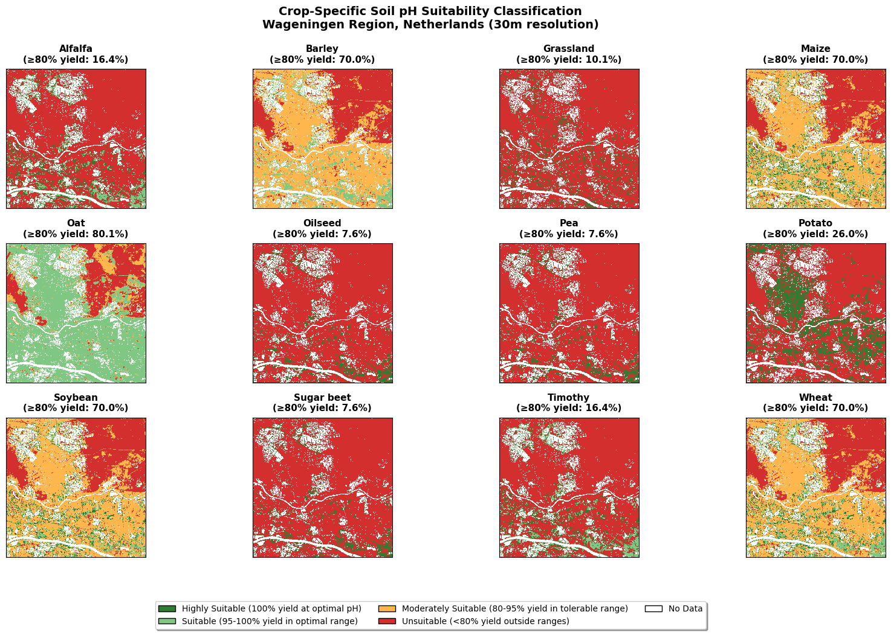

# Knowledge Graph-Driven Soil Health Decision Support

This repository contains a single end-to-end Jupyter notebook (`KG_DS_system.ipynb`) that demonstrates how knowledge graph reasoning can steer soil health analytics. The workflow streams soil property rasters directly from the EcoDataCube, queries the Soil Health Knowledge Graph (SHKG) for agronomic thresholds, and applies those rules to classify soil condition and crop suitability in the Wageningen, NL test area.

## Notebook Highlights

- Stream 30m soil property rasters (pH, organic carbon, clay, sand, bulk density) and EuroCrops land-use from the EcoDataCube STAC API.
- Parse SHKG triples (both the `soil_health_KG.ttl` graph and the JSON export in `soil_prop_thres.json`) to recover soil pH semantics, toxicity warnings, and crop requirements.
- Classify soil health by mapping the KG-derived thresholds onto the gridded pH data (see figure below).
- Quantify measurement uncertainty by combining STAC p16/p84 rasters with KG thresholds, producing confidence and uncertainty surfaces.
- Compare KG-guided outputs with the EU Soil Degradation dashboard (20-indicator multiband raster) to highlight where conventional indicators and KG reasoning agree or diverge.
- Use KG lookups to link crop types to their preferred pH ranges and evaluate predicted EuroCrops classes against KG expectations.

## Workflow Walkthrough

### 1. Stream Digital Soil Mapping Layers

The notebook calls the EcoDataCube STAC API (maintained by OpenGeoHub) to retrieve Wageningen digital soil mapping layers for pH, texture, carbon, and crop cover.

### 2. Query the Soil Health Knowledge Graph

SHKG triples are loaded into `rdflib.Graph` objects from the Turtle file and the JSON export. Two main SPARQL queries drive the reasoning:

```sparql
PREFIX skos: <http://www.w3.org/2004/02/skos/core#>
PREFIX she: <https://soilwise-he.github.io/soil-health#>
PREFIX agrontology: <http://aims.fao.org/aos/agrontology#>
PREFIX sorelm: <http://sweetontology.net/relaMath/>
PREFIX qudt: <http://qudt.org/schema/qudt/>
PREFIX obo: <http://purl.obolibrary.org/obo/>
PREFIX af-x: <http://purl.allotrope.org/ontologies/property#>

SELECT ?threshold_type ?value ?predicate ?related_property
WHERE {
  she:SoilpH ?threshold_type ?node .
  ?node qudt:numericValue | sorelm:hasInterval ?value .
  OPTIONAL { ?node obo:RO_0002212 ?neg_prop . BIND(obo:RO_0002212 AS ?predicate) BIND(?neg_prop AS ?related_property) }
  OPTIONAL { ?node obo:RO_0002213 ?pos_prop . BIND(obo:RO_0002213 AS ?predicate) BIND(?pos_prop AS ?related_property) }
  OPTIONAL { ?node agrontology:causes ?cause . BIND(agrontology:causes AS ?predicate) BIND(?cause AS ?related_property) }
  OPTIONAL { ?node skos:related ?warning . BIND(skos:related AS ?predicate) BIND(?warning AS ?related_property) }
  OPTIONAL { ?node agrontology:isBeneficialFor ?benefit . BIND(agrontology:isBeneficialFor AS ?predicate) BIND(?benefit AS ?related_property) }
}
ORDER BY ?threshold_type ?value
```

This query returns the toxic, unhealthy, intermediate, healthy, and nutrient-deficit thresholds (4.5, 5.5, 6.0, 7.0) together with their causal annotations (aluminium toxicity risk, zinc availability, beneficial crop ranges, and so on). A companion query enumerates crop-specific requirements:

```sparql
PREFIX she: <https://soilwise-he.github.io/soil-health#>
PREFIX skos: <http://www.w3.org/2004/02/skos/core#>
PREFIX qudt: <http://qudt.org/schema/qudt/>
PREFIX sorelm: <http://sweetontology.net/relaMath/>

SELECT ?crop ?cropLabel ?optimalValue ?optimalInterval ?tolerableInterval
WHERE {
    ?crop a skos:Concept ;
          skos:prefLabel ?cropLabel .
    
    # Optional: Optimal pH numeric value (100% yield)
    OPTIONAL {
        ?crop she:hasOptimalSoilpH ?optimal .
        ?optimal qudt:numericValue ?optimalValue .
    }
    
    # Optional: Optimal pH interval (95%+ yield)
    OPTIONAL {
        ?crop she:hasOptimalSoilpH ?optimalRange .
        ?optimalRange sorelm:hasInterval ?optimalInterval .
    }
    
    # Optional: Tolerable pH interval (80%+ yield)
    OPTIONAL {
        ?crop she:hasTolerableSoilpH ?tolerableRange .
        ?tolerableRange sorelm:hasInterval ?tolerableInterval .
    }
    
    # Filter: Only include crops with at least one pH requirement
    FILTER (BOUND(?optimalValue) || BOUND(?optimalInterval) || BOUND(?tolerableInterval))
}
ORDER BY ?cropLabel
```

For clarity, the query surfaces entries such as:

- barley: optimal 6.8-7.5 (tolerable 5.7-7.5)
- maize: optimal 6.5-6.8 (tolerable 6.5-6.8)
- oat: optimal 5.7-7.5 (tolerable 5.0-7.5)
- soybean: optimal 6.8-7.0 (tolerable 5.7-7.5)

These examples illustrate how SHKG constraints feed directly into the spatial analytics so that crop suitability reflects the encoded agronomic expertise.

### 3. Classify Soil pH and Visualize Results

The KG-derived thresholds initialize a labeled palette: Toxic (<= 4.5), Unhealthy (4.5-5.5), Intermediate (5.5-6.0), Healthy (6.0-7.0), Nutrient Deficit (> 7.0). These bins are applied across the pH raster to derive both a classified grid and summary statistics. The notebook plots raw pH alongside the semantic classes, adding legends, pixel counts, and textual summaries that explain what proportion of the area of interest sits in each KG-defined health band.



### 4. Quantify Uncertainty

STAC percentile rasters (p16 and p84) are pulled for the same footprint, converted to pH, and combined with the KG thresholds to compute per-pixel confidence scores. Pixels with less than 80 percent confidence are highlighted, and mean confidence per class is reported. The resulting map, confidence surface, and uncertainty overlay illustrate where additional sampling would be valuable.



### 5. Cross-check with EU Soil Degradation Indicators

A 20-band EU degradation raster is subset to the Wageningen window. Each band is visualized and summarized, and the KG-derived pH classes are juxtaposed in a shared figure. The summary text flags which conventional degradation indicators exceed 10 percent unhealthy coverage, providing context for how KG reasoning complements or challenges existing monitoring products.

### 6. Reason About Crop Suitability

EuroCrops land-use classes are aligned with KG crop entities, and the SPARQL outputs above are used to check whether observed or predicted crops sit inside their optimal pH intervals. Confusion matrices, coverage maps, and crop-specific summaries highlight which crops align with their recommended soil chemistry.



Run the notebook from top to bottom to reproduce the outputs. The cells are organized so that KG parsing, raster access, classification, and crop reasoning can also be run independently if you only need part of the workflow.
